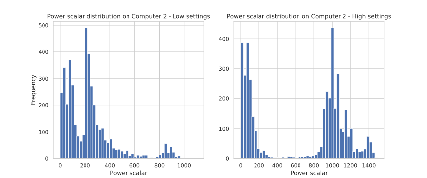
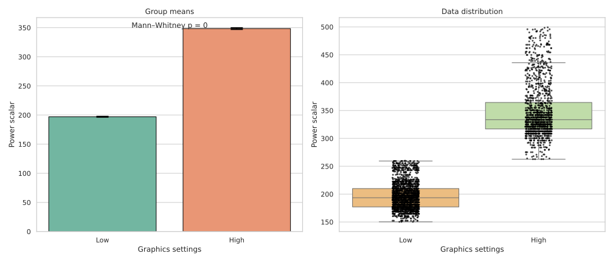
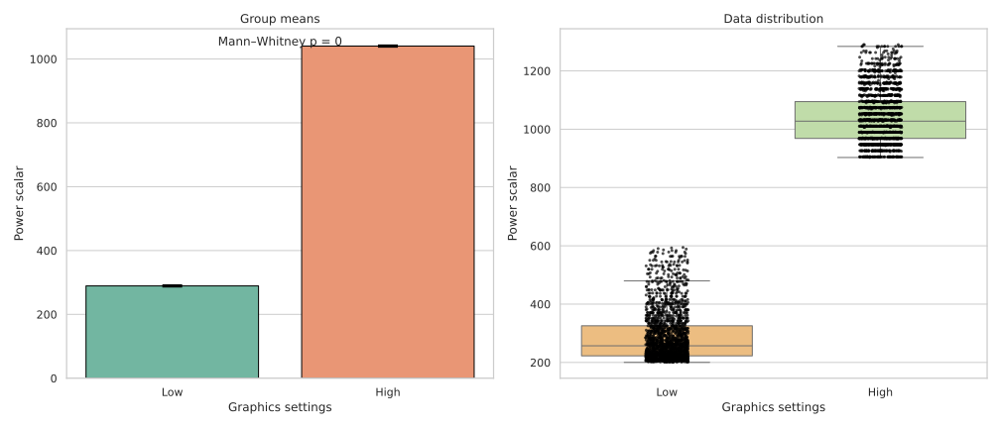
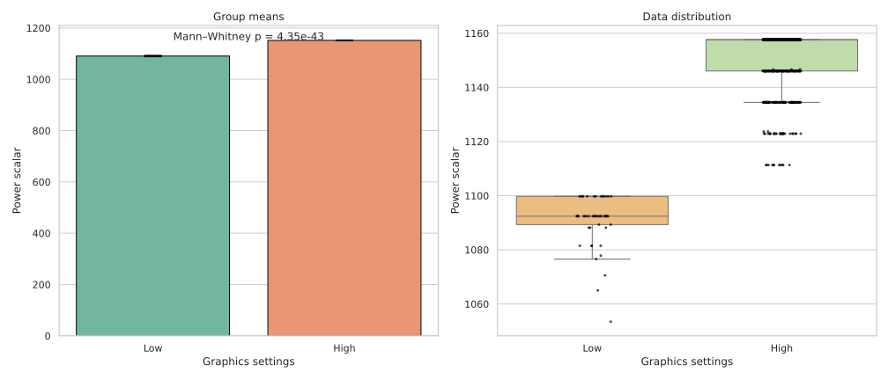

# Introduction

The increased use of computers has led to a rise in global energy consumption. 
It is estimated that software will account for 51% of all electricity usage as early as 2030. 
This means that software will be responsible for 23% of global greenhouse gas emissions in the coming decades [(Andrae & Edler, 2015)](https://www.mdpi.com/2078-1547/6/1/117).
As a result, software companies are placing greater emphasis on sustainability to create long-term value without harming the environment.

A branch of existing software systems that is constantly growing is the gaming industry, with about 2.6 billion global gamers and gaming titles available on almost every digital device, making video games one of the most popular and enduring hobbies worldwide [(Topic: Video Gaming Worldwide, 2024)](https://www.statista.com/topics/1680/gaming/#topicOverview). 
To satisfy this massive player base, companies strive to develop games with greater realism, improved physics engines, and enhanced graphics, all of which require more computational power. 
This is evident in the gaming industry, where new games demand increasingly advanced GPUs as minimum requirements. 
Despite this vast player base, the gaming industry has not been as proactive in addressing environmental sustainability as other computing technology sectors [(Pérez et al., 2024)](https://arxiv.org/abs/2402.06346).  

As a result of the ever-growing impact of the gaming industry on the environment we decided to investigate the difference in energy consumption for high graphic settings in games in comparison to low graphic settings. To achieve this goal we decided to measure the difference in energy usage within a single game at different graphic settings. For this study, we selected *GTA V*, which still has 30 million active monthly players 12 years after its release [(Xoob & Xoob, 2024)](https://activeplayer.io/grand-theft-auto-v/). This game was not only selected for its relevance, but also because it is playable over a wide array of graphic settings, supporting both modern powerful GPU's and lower-tier older GPU's. 

To ensure the reproducibility of the experiment, we used the game's built-in benchmark test across multiple computers. Our results show that............... TODO

# Methodology
During the experiment, it was crucial to measure the energy consumption of the selected game as accurately as possible while minimizing interference from other background programs.
This is essential for ensuring the reproducibility of our results across different computers.
A background program that significantly affects energy consumption in one test might not be running on another system, leading to inconsistencies in the results.
To achieve this, we closed all unnecessary programs, keeping only essential background services running.
These were indicated by taskbar icons and included Windows Defender, the NVIDIA app, Epic Games Launcher, Rockstar Launcher, and the audio driver.  

Furthermore, we placed emphasis on warming up the system before starting the experiment and allowing cooldown periods between each run.
This was achieved by running a non-recorded warm-up benchmark test before data collection and restarting the game between runs, which takes about a minute to ensure proper cooldown.  

We compared two different graphics settings, classified as a low graphics quality run and a high graphics quality run. On each computer, we ran the benchmark test 15 times for both the low and high settings, totaling 30 runs per PC. Initially, we considered running a higher number of tests per setting, but given that each benchmark test takes approximately 3 minutes per run, we realized this would require a significant amount of time, and we were unable to find a way to automate the measurements. Fortunately, our measurement software captured samples every second during the 3 minute benchmark, so this can be seen as 15 sets of hundreds of measurements per case, rather than just 15 measurements per case.

To ensure reliable results, we conducted the same experiments on different PCs. This allowed us to compare the results and determine whether the difference in energy consumption between low and high settings on a single PC was consistent across multiple systems.  To that effect, Vsync was turned on for both graphic settings. This setting caps the framerate at the monitor refresh rate, 60hz in this case for the computers. If this setting is left off, the game will try to render as many frames as possible, which means the GPU will be at or near maximum utilization regardless of graphics settings.

## Graphics Settings
The number of available options for each graphics setting varies, ranging from 2 to 6 choices.
Most settings have options such as *Normal*, *High*, and *Very High*, while some also include *Ultra* and others are limited to simple *On-Off* options.  

To ensure a clear difference between runs, settings with *On-Off* options were set to *Off* for the low graphics run and *On* for the high graphics run.
For settings with more than two options, we selected the lowest computationally demanding option (*Normal*) for the low run and increased it by two levels for the high run, which was typically *Very High*. 

This selection method was designed to create a noticeable difference in power consumption that could be reliably detected.
The specific settings used are included in appendix A to ensure the replicability of our results.  

## Experiment procedure
Our experiment procedure is outlined below, to ensure the results are reproducable. The experiment first has a startup procedure, followed by a segment to be repeated 15 times for each setting to take the measurements.

1. Ensure notifications are turned off
2. Everything closed (including background applications) except for the Rockstar Launcher and GPU-Z. Running background services (indicated by taskbar icons) are limited to Windows Defender, the Nvidia app and the audio driver.
3. Only connected devices are a keyboard, mouse and a monitor.
4. The computer is connected to the internet using an ethernet cable (GTA V needs an internet connection to launch).
5. Power mode set to "best performance" in Windows.
6. Start GTA V
7. Run benchmark test without measurement for warm-up

Repeat 15 times for low settings and 15 times for high settings:

8. Start a new logging file in GPU-Z with appropriate naming
9. Run benchmark test
10. GTA V restarts automatically after benchmark, allowing for a cooldown period

## Data collection
During the course the software EnergiBridge was recommended for use during the project. We found EnergiBridge to be unsuitable for our purposes as it is less focused on measuring GPU power consumption and therefore started looking for alternative software. We decided instead to use GPU-Z, which records GPU metrics, this fits our purposes as we are running a GPU intensive task and less a CPU intensive task. While GPU-Z did not seem to be giving accurate measurements of GPU power consumption, it did provide other values from which we were able to estimate power consumption.

[According to Reddit user Blandbl on the /r/overclocking forum](https://www.reddit.com/r/overclocking/comments/gnwshv/how_cpugpu_power_consumption_behaves_example_rx/), the equation that describes power consumption of a GPU is given by
$P = \alpha C V^2 f$, where $P$ is power in Watts, $\alpha$ is the activity factor (GPU utilization percentage), $V$ is the voltage, $f$ is the frequency (clock speed) of the GPU, and $C$ is capacitance.

This expression is seemingly based on the [equation for dynamic power consumption of a CPU](https://en.wikipedia.org/wiki/Processor_power_dissipation). It assumes all transistors are active at the same time. The GPU version with the activity factor $\alpha$ takes transistor activity into account.

Assuming that capacitance is an inherent property of a GPU and therefore constant, we estimated power consumption using $\alpha V^2 f$, since all underlying quantites are measured by GPU-Z. This is equivalent to $P/C$, which should be directly proportional to $P$ assuming constant $C$. We refer to this $P/C$ quantity as the "power scalar", and report relative differences between low and high settings per computer.

## Hardware/Software Details
The trials were run on two different computer to ensure our findings are consistent. The results of both computers were compared and combined to achieve our final results. The specifications of both computers are listed below.

### Computer 1: 
- Intel Core i5-9600k
- 16GB DDR4 RAM
- Nvidia GeForce RTX 2060
- Samsung 970 Evo Plus M.2 SSD

### Computer 2: 
- Intel Core i7-7700k
- 16GB DDR4 RAM
- EVGA GeForce GTX 1070
- Samsung 970 Evo Plus M.2 SSD

TODO: add computer 3

# Results
The GPU-Z log files gave us time-series data, from which we calculated the power scalar over time, using the [expression stated earlier](#data-collection). The figure below shows an example measurement from several runs of the benchmark. The jumps between low and high power scalar values between scenes of the benchmark can be clearly seen.

To isolate the distrbutions of the high power scalar values, we aggregated the measurements from all 15 runs per computer per settings configuration, and plotted their histograms. Below is an example of two such histograms. One corresponds to low settings and shows a bimodal distribution - one peak corresponds to low power scalar measurements when the GPU was inactive between benchmark scenes, and the other peak corresponds to high power scalar measurements when the GPU was active during the benchmark scenes. The histogram corresponding to high settings tells a similar story, except the second peak is at a higher power scalar value, since the GPU was consuming more power rendering the game at a higher graphics quality.

Since this bimodal trend emerged in measurements from all computers, we decided to use this histogram technique to isolate the distrbutions where the GPU was active. Below is an example - the high settings histogram above zoomed in on the active GPU distribution.

Notably, none of the measurements appeared normally distributed, despite a large number of samples. This was confirmed for all distributions using the Shapiro-Wilk test - the figure above has a p-value of $3.88 \times 10^{27}$. This is not surprising, because we observed our GPUs quickly trending towards specific frequency, voltage and utilization combinations under load, and deviating only slightly higher during more intense parts of the benchmark. In a following section, we will use the Mann-Whitney (which does not assume normal distributions) test to evaluate statistical significance between low and high settings.

# Analysis
The following table compares means, standard errors, test statistics and relative changes for all 3 computers. Note that a Mann-Whitney p-value of 0 indicates a value so low that it is inndistinguishable from 0 at machine precision.

|            | Mean power scalar low settings | Mean power scalar high settings | Mann-Whitney p-value   | High/low percent change |
|------------|:------------------------------:|---------------------------------|------------------------|-------------------------|
| Computer 1 | $197.020 \pm 0.521$            | $348.448 \pm 1.310$             | $0$                    | 76.859                  |
| Computer 2 | $289.282 \pm 1.913$            | $1040.533 \pm 1.974$            | $0$                    | 259.695                 |
| Computer 3 | $1090.662 \pm 1.353$           | $1151.618 \pm 0.291$            | $4.35 \times 10^{-43}$ | 5.589                   |

For a more detailed look, the figures below compare means and spreads of the low settings case vs. the high settings case for each computer.

## Computer 1

## Computer 2

## Computer 3

## Statistical significance
**To Do**
 - Comment on the fact that just by looking at the figures, the difference is obvious. The p values confirm this and are so low that they are basically 0.

## Practical significance
**To Do**
Is this difference in power consumption big enough that it is also significant in real life? For example, when it is compared to average/total energy consumption of the game/pc?

Comment on how power consumption is almost double for Computer 1 and almost quadruple for Computer 2 for an improvement in graphics quality that cannot really be called "double" quality. Computer 3 is an exception.

# Discussion
##
**To Do**
Do the results show a significant difference in energy consumption and do we think that game industry should strive for more energy efficient games?

## Limitations & future work

### Low number of experiments
For optimal results it would be desirable to have more than two computers run the experiments. In practice this is not achievable as computers capable of running GTA V come at great cost and we were therefore limited to the amount of capable systems available to us.  

### Only measuring GPU power consumption
To get a more realistic picture of the total power consumption of a game it is desirable to measure the energy consumption of the entire computer while running the game. However, doing so would require a physical device to measure the power consumed by the computer at the wall outlet. This kind of equipment is beyond the scope of this project and therefore it was decided to only measure GPU power consumption, as this is possible using software tools and the GPU is the most strained component while running the game.

# Conclusion

# Appendix

## A: Graphics Settings

### Low Run
| Name | Setting | 
|---|---|
| FXAA | On |
| MSAA | x4 |
| NVIDIA TXAA | On |
| VSync | On |
| Pause Game On Focus Loss | On |
| Population Density | 100% |
| Population Variety | 100% |
| Distance Scaling | 100% |
| Texture Quality | Normal |
| Shader Quality | Normal | 
| Shadow Quality | Normal |
| Reflection Quality | Normal |
| Reflection MSAA | Off |
| Water Quality | Normal |
| Particles Quality | Normal |
| Grass Quality | Normal |
| Soft Shadows | Soft |
| Post FX | Normal |
| Motion Blur Strength | 0% |
| In-Game Depth Of Field Effects | Off |
| Anisotropic Filtering -| Off |
| Ambient Occlusion | Off |
| Tessellation | Off |

### High Run
| Name | Setting | 
|---|---|
| FXAA | On |
| MSAA | x4 |
| NVIDIA TXAA | On |
| VSync | On |
| Pause Game On Focus Loss | On |
| Population Density | 100% |
| Population Variety | 100% |
| Distance Scaling | 100% |
| Texture Quality | Very High |
| Shader Quality | Very High | 
| Shadow Quality | Very High |
| Reflection Quality | Very High |
| Reflection MSAA | x4 |
| Water Quality | Very High |
| Particles Quality | Very High |
| Grass Quality | Very High |
| Soft Shadows | Softest |
| Post FX | Very High |
| Motion Blur Strength | 0% |
| In-Game Depth Of Field Effects | On |
| Anisotropic Filtering -| x4 |
| Ambient Occlusion | High |
| Tessellation | Very High |
